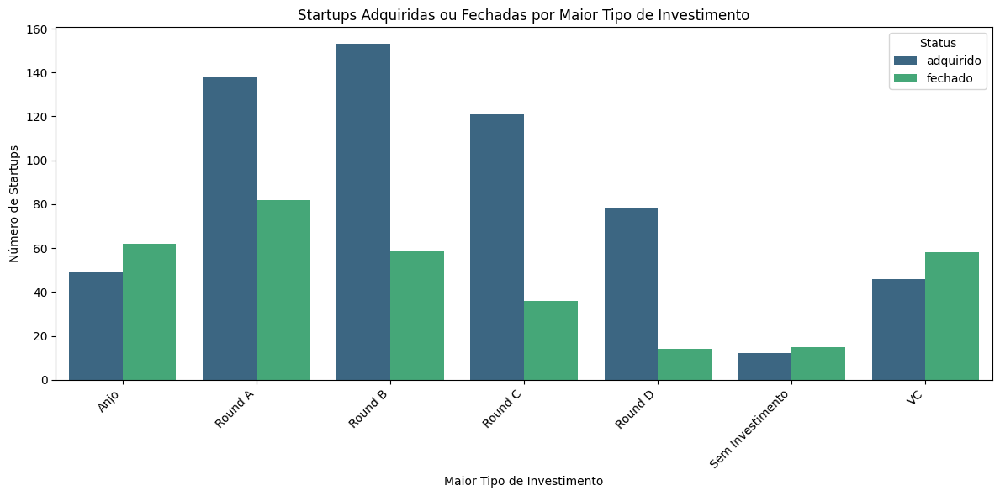
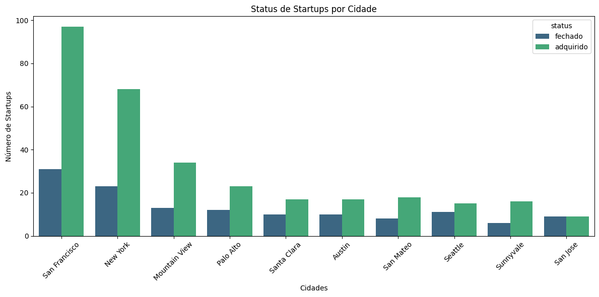
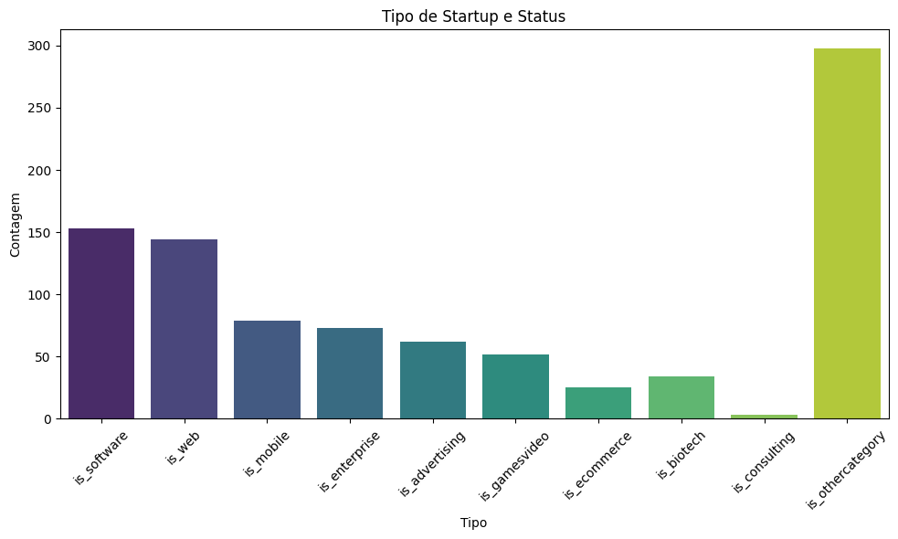
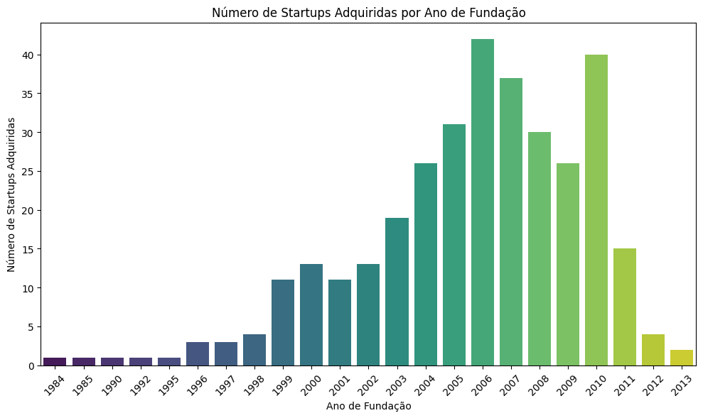
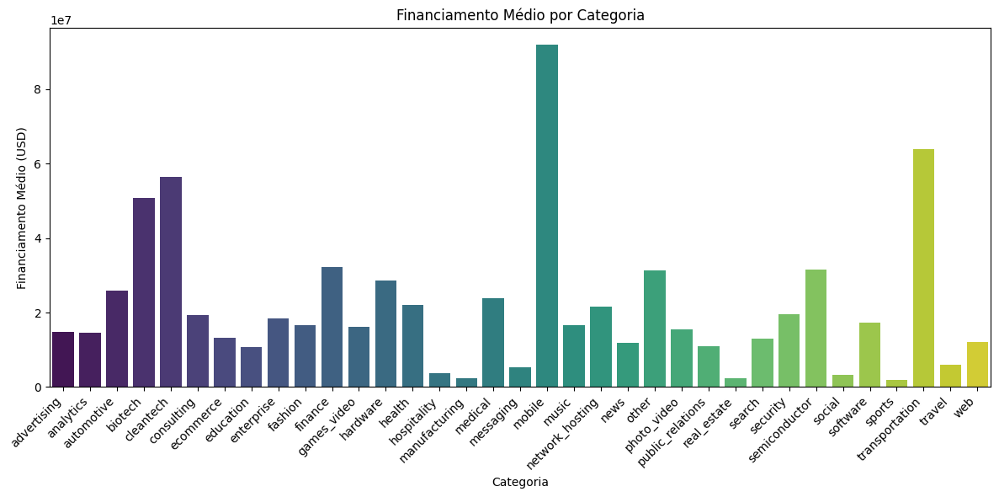
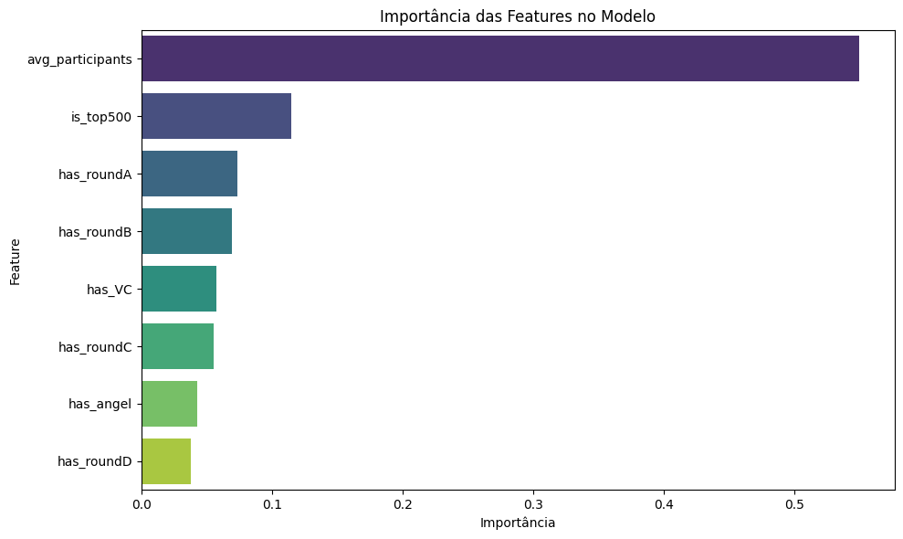

# Processo Seletivo LAPES - 2024

Este repositório apresenta uma análise detalhada dos dados contidos no arquivo `startup_data.csv`.

## Sumário

- [Introdução](#introdução)
- [Instalação](#instalação)
- [Descrição dos Dados](#descrição-dos-dados)
- [Pré-processamento de Dados](#pré-processamento-de-dados)
- [Análise Exploratória de Dados](#análise-exploratória-de-dados)
  - [Status das Startups](#status-das-startups)
  - [Tipos de Investimento](#tipos-de-investimento)
  - [Distribuição Geográfica](#distribuição-geográfica)
  - [Categorias de Startups](#categorias-de-startups)
  - [Análise Temporal](#análise-temporal)
  - [Financiamento Médio por Categoria](#financiamento-médio-por-categoria)
- [Modelagem Preditiva](#modelagem-preditiva)
  - [Seleção de Features](#seleção-de-features)
  - [Divisão de Dados](#divisão-de-dados)
  - [Treinamento do Modelo](#treinamento-do-modelo)
  - [Avaliação do Modelo](#avaliação-do-modelo)
  - [Análise do Relatório de Classificação](#análise-do-relatório-de-classificação)
  - [Importância das Features](#importância-das-features)
- [Conclusão](#conclusão)
- [Referências](#referências)

## Introdução

O objetivo deste projeto é explorar e identificar padrões nos dados de startups, analisando aspectos como tipos de investimento, localização geográfica, categorias de negócio e tendências temporais.

Para isso, foram utilizadas bibliotecas como **Pandas** para manipulação e tratamento dos dados, **Seaborn** e **Matplotlib** para visualização gráfica, e **Scikit-learn** para modelagem preditiva.

## Instalação

Para executar este projeto localmente, siga as instruções abaixo:

1. **Clone o repositório:**

   ```bash
   git clone https://github.com/giovannibragasv/ps-lapes.git
   ```

2. **Acesse o diretório do projeto:**

   ```bash
   cd ps-lapes
   ```

3. **Execute o notebook ou o script Python:**

   ```bash
   jupyter notebook ps-lapes.ipynb
   ```

## Descrição dos Dados

O conjunto de dados `startup_data.csv` reúne informações detalhadas sobre diversas startups, incluindo:

- **Informações Gerais:**
  - `name`: Nome da startup.
  - `category_code`: Categoria de atuação.
  - `city`, `state_code`: Localização geográfica.

- **Datas Importantes:**
  - `founded_at`: Data de fundação.
  - `closed_at`: Data de fechamento ou aquisição.

- **Investimentos:**
  - `funding_total_usd`: Total de financiamento recebido.
  - `has_angel`, `has_VC`: Indicadores de tipos de investimento recebidos.
  - `has_roundA`, `has_roundB`, `has_roundC`, `has_roundD`: Indicação de participação em diferentes rounds de investimento.

- **Outros Atributos:**
  - `status`: Status atual da startup (`acquired` ou `closed`).
  - `avg_participants`: Média de participantes nos investimentos.
  - `is_top500`: Indica se a startup está entre as top 500.

## Pré-processamento de Dados

O pré-processamento de dados é uma etapa crucial para garantir a qualidade da análise. As seguintes ações foram realizadas:

1. **Carregamento dos Dados:**

   Importação do conjunto de dados utilizando o Pandas:

   ```python
   import pandas as pd

   df = pd.read_csv('startup_data.csv')
   ```

2. **Renomeação de Colunas:**

   Renomeação da coluna `Unnamed: 6` para `address` para melhor compreensão:

   ```python
   df = df.rename(columns={'Unnamed: 6': 'address'})
   ```

3. **Tratamento de Valores Nulos:**

   - **Status:**

     Conversão dos status `acquired` e `closed` para `adquirido` e `fechado`, respectivamente:

     ```python
     df['status'] = df['status'].replace({'acquired': 'adquirido', 'closed': 'fechado'})
     ```

   - **Financiamento Total:**

     Conversão da coluna `funding_total_usd` para numérico, substituindo valores inválidos pela mediana:

     ```python
     df['funding_total_usd'] = pd.to_numeric(df['funding_total_usd'], errors='coerce')
     df['funding_total_usd'] = df['funding_total_usd'].fillna(df['funding_total_usd'].median())
     ```

   - **Datas:**

     Conversão da coluna `founded_at` para datetime, substituindo valores nulos pela mediana:

     ```python
     df['founded_at'] = pd.to_datetime(df['founded_at'], errors='coerce')
     median_date = df['founded_at'].median()
     df['founded_at'] = df['founded_at'].fillna(median_date)
     df['founded_year'] = df['founded_at'].dt.year
     ```

4. **Criação de Novas Colunas:**

   Criação da coluna `maior_investimento` para identificar o nível mais alto de investimento recebido:

   ```python
   def maior_investimento(row):
       if row['has_roundD'] == 1:
           return 'Round D'
       elif row['has_roundC'] == 1:
           return 'Round C'
       elif row['has_roundB'] == 1:
           return 'Round B'
       elif row['has_roundA'] == 1:
           return 'Round A'
       elif row['has_VC'] == 1:
           return 'VC'
       elif row['has_angel'] == 1:
           return 'Anjo'
       else:
           return 'Sem Investimento'

   df['maior_investimento'] = df.apply(maior_investimento, axis=1)
   ```

## Análise Exploratória de Dados

A análise exploratória permite compreender melhor os dados e identificar padrões significativos.

### Status das Startups

Contagem do número de startups adquiridas e fechadas:

```python
count_status = df['status'].value_counts()
```

- **Resultado:**

  - Adquiridas: *quantidade*
  - Fechadas: *quantidade*

### Tipos de Investimento

Análise da relação entre o status das startups e os tipos de investimento recebidos:

```python
colunas_investimento = ['has_angel', 'has_VC', 'has_roundA', 'has_roundB', 'has_roundC', 'has_roundD']
status_investimento = df.groupby('status')[colunas_investimento].sum().reset_index()
```

Visualização dos dados:

```python
import seaborn as sns
import matplotlib.pyplot as plt

status_investimento_melted = status_investimento.melt(id_vars='status', var_name='Tipo de Investimento', value_name='Quantidade')

plt.figure(figsize=(12, 8))
sns.barplot(data=status_investimento_melted, x='Quantidade', y='status', hue='Tipo de Investimento', palette='viridis')
plt.xlabel('Quantidade de Startups')
plt.ylabel('Status')
plt.title('Quantidade de Startups por Status e Tipo de Investimento')
plt.legend(title='Tipo de Investimento', loc='upper right')
plt.tight_layout()
plt.show()
```



**Interpretação:**

- Startups com rounds de investimento mais avançados (Rounds C e D) tendem a ser adquiridas.
- A maioria das startups fechadas não passou dos investimentos iniciais.

### Distribuição Geográfica

Análise das cidades com maior número de startups e o status em cada uma delas:

```python
top_cidades = df['city'].value_counts().nlargest(10).index
ordem_cidades = df[df['city'].isin(top_cidades)]['city'].value_counts().loc[top_cidades].index
```

Visualização:

```python
plt.figure(figsize=(12, 6))
sns.countplot(x='city', hue='status', data=df[df['city'].isin(top_cidades)], order=ordem_cidades, palette='viridis')
plt.title("Status de Startups por Cidade")
plt.ylabel('Número de Startups')
plt.xlabel('Cidades')
plt.xticks(rotation=45)
plt.tight_layout()
plt.show()
```



**Interpretação:**

- **São Francisco** lidera em número de startups adquiridas, seguido por **Nova Iorque** e **Mountain View**.
- Polos tecnológicos como São Francisco e Nova Iorque possuem maior taxa de aquisição.
- A região do Vale do Silício apresenta uma significativa concentração de aquisições.

### Categorias de Startups

Exame das categorias de startups e sua correlação com o sucesso:

```python
colunas_tipo = [
    'is_software', 'is_web', 'is_mobile', 'is_enterprise',
    'is_advertising', 'is_gamesvideo', 'is_ecommerce',
    'is_biotech', 'is_consulting', 'is_othercategory'
]
count_tipo = df[colunas_tipo].sum().reset_index()
count_tipo.columns = ['Tipo', 'Contagem']
```

Visualização:

```python
plt.figure(figsize=(10, 6))
sns.barplot(data=count_tipo, x='Tipo', y='Contagem', palette='viridis')
plt.title('Distribuição de Tipos de Startups')
plt.xticks(rotation=45)
plt.tight_layout()
plt.show()
```



**Interpretação:**

- **Software** e **Web** são as categorias com maior quantidade de startups adquiridas.

### Análise Temporal

Investigação de como o número de startups adquiridas varia ao longo dos anos:

```python
df['acquired'] = df['status'] == 'adquirido'
acquired_counts = df.groupby('founded_year')['acquired'].sum().reset_index()
```

Visualização:

```python
plt.figure(figsize=(10, 6))
sns.lineplot(data=acquired_counts, x='founded_year', y='acquired', marker='o', color='green')
plt.xlabel('Ano de Fundação')
plt.ylabel('Número de Startups Adquiridas')
plt.title('Startups Adquiridas por Ano de Fundação')
plt.tight_layout()
plt.show()
```



**Interpretação:**

- Startups fundadas no final dos anos 2000 foram mais adquiridas, possivelmente devido a evoluções tecnológicas significativas.

### Financiamento Médio por Categoria

Análise do financiamento médio recebido por startups em diferentes categorias:

```python
avg_funding_by_category = df.groupby('category_code')['funding_total_usd'].mean().reset_index()
```

Visualização:

```python
plt.figure(figsize=(12, 6))
sns.barplot(data=avg_funding_by_category, x='category_code', y='funding_total_usd', palette='viridis')
plt.xlabel('Categoria')
plt.ylabel('Financiamento Médio (USD)')
plt.title('Financiamento Médio por Categoria')
plt.xticks(rotation=45, ha='right')
plt.tight_layout()
plt.show()
```



**Interpretação:**

- Categorias como **mobile** e **transportation** tendem a receber maiores financiamentos médios.
- Setores mais tecnológicos podem exigir investimentos iniciais mais elevados.

---

## Modelagem Preditiva

Foi construído um modelo de **Random Forest** para prever o status das startups com base em características selecionadas.

### Seleção de Features

Foram selecionadas features relevantes que podem influenciar o status da startup:

```python
features = [
    'has_VC', 'has_angel', 'has_roundA', 'has_roundB',
    'has_roundC', 'has_roundD', 'avg_participants', 'is_top500'
]
```

### Divisão de Dados

Divisão dos dados em conjuntos de treinamento e teste:

```python
from sklearn.model_selection import train_test_split

X = df[features]
y = df['status'].map({'adquirido': 1, 'fechado': 0})

X_train, X_test, y_train, y_test = train_test_split(X, y, test_size=0.3, random_state=42)
```

### Treinamento do Modelo

Treinamento do modelo de Random Forest:

```python
from sklearn.ensemble import RandomForestClassifier

modelo = RandomForestClassifier(random_state=42)
modelo.fit(X_train, y_train)
```

### Avaliação do Modelo

Avaliação do desempenho do modelo no conjunto de teste:

```python
from sklearn.metrics import classification_report

y_pred = modelo.predict(X_test)
print(classification_report(y_test, y_pred))
```

### Resultado

```
              precision    recall  f1-score   support

           0       0.53      0.50      0.52       100
           1       0.73      0.75      0.74       177

    accuracy                           0.66       277
   macro avg       0.63      0.63      0.63       277
weighted avg       0.66      0.66      0.66       277
```

### Análise do Relatório de Classificação

#### Classes

- **Classe 0**: Representa startups **"fechadas"**.
- **Classe 1**: Representa startups **"adquiridas"**.

#### Explicação das Métricas

1. **Precisão (Precision)**

   - **Definição**: Proporção de previsões positivas corretas.
   - **Interpretação**: De todas as startups que o modelo previu como pertencentes a uma determinada classe, quantas estavam corretas?

2. **Revocação (Recall)**

   - **Definição**: Proporção de verdadeiros positivos identificados corretamente.
   - **Interpretação**: De todas as startups que realmente pertencem a uma classe, quantas o modelo conseguiu prever corretamente?

3. **F1-Score**

   - **Definição**: Média harmônica entre precisão e revocação.
   - **Interpretação**: Equilíbrio entre precisão e revocação. Um F1-score mais alto indica melhor desempenho do modelo.

4. **Suporte (Support)**

   - **Definição**: Número de ocorrências reais de cada classe no conjunto de teste.
   - **Interpretação**: Quantidade de amostras de cada classe no conjunto de teste.

#### Análise das Classes

- **Classe 0 ("fechadas")**

  - **Precisão**: 53%
  - **Revocação**: 50%
  - **F1-Score**: 52%
  - **Interpretação**: O modelo tem desempenho moderado na previsão de startups que fecharam.

- **Classe 1 ("adquiridas")**

  - **Precisão**: 73%
  - **Revocação**: 75%
  - **F1-Score**: 74%
  - **Interpretação**: O modelo apresenta bom desempenho na previsão de startups adquiridas.

### Importância das Features

Análise da importância de cada feature no modelo:

```python
importances = modelo.feature_importances_
feature_importance_df = pd.DataFrame({
    'Feature': features,
    'Importance': importances
}).sort_values(by='Importance', ascending=False)
```

Visualização:

```python
plt.figure(figsize=(10, 6))
sns.barplot(data=feature_importance_df, x='Importance', y='Feature', palette='viridis')
plt.title('Importância das Features no Modelo')
plt.xlabel('Importância')
plt.ylabel('Feature')
plt.tight_layout()
plt.show()
```



**Interpretação Geral:**

- **`avg_participants`** é a feature mais importante, indicando que o número médio de participantes nos investimentos é um forte indicador do status da startup.
- Features relacionadas a estágios iniciais de financiamento (como `has_roundA` e `has_roundB`) têm mais importância do que as rodadas posteriores.
- Estar entre as top 500 empresas (`is_top500`) também é um indicador significativo de sucesso ou aquisição.

## Conclusão

Através desta análise detalhada dos dados de startups, foi possível extrair insights significativos sobre os fatores que influenciam o sucesso ou o fechamento de uma startup. Alguns dos principais pontos observados incluem:

1. **A Importância dos Investimentos:**

   - Startups que progridem para rounds de investimento mais avançados (Rounds B, C e D) apresentam uma probabilidade significativamente maior de serem adquiridas, indicando que o acesso a capital em estágios posteriores é crucial para o crescimento e sustentabilidade a longo prazo.
   - A obtenção de investimentos iniciais, como de investidores anjo e venture capital, é fundamental para o desenvolvimento inicial, mas não garante necessariamente o sucesso futuro sem progressão para rounds subsequentes.

2. **Influência da Localização Geográfica:**

   - Ecossistemas tecnológicos robustos, especialmente em cidades como São Francisco e Nova Iorque, oferecem vantagens competitivas significativas para startups, incluindo acesso a capital, talentos qualificados e redes de networking.
   - A concentração de startups bem-sucedidas em certas regiões reforça a importância do ambiente empreendedor e do suporte local no sucesso empresarial.

3. **Setores de Atuação e Sucesso:**

   - Embora setores como software e web sejam populares e recebam atenção significativa, a categoria de atuação por si só não é um indicador definitivo de sucesso ou aquisição.
   - Setores que demandam maiores investimentos médios, como mobile e cleantech, não necessariamente apresentam maiores taxas de aquisição, sugerindo que outros fatores, como modelo de negócio e execução, são igualmente importantes.

4. **Tendências Temporais e Impacto Econômico:**

   - A análise temporal revelou que startups fundadas em determinados períodos, especialmente no final dos anos 2000, tiveram maiores taxas de aquisição, possivelmente devido a avanços tecnológicos significativos ou condições econômicas favoráveis.
   - Eventos macroeconômicos e tendências de mercado têm impacto direto no ecossistema de startups, influenciando oportunidades de investimento e crescimento.

5. **Eficácia da Modelagem Preditiva:**

   - O modelo de Random Forest desenvolvido demonstrou desempenho satisfatório na previsão do status das startups, destacando-se a importância da média de participantes nos investimentos e a posição no ranking top 500 como features mais influentes.
   - A compreensão das variáveis-chave que contribuem para o sucesso permite que empreendedores e investidores tomem decisões mais informadas, otimizando estratégias de crescimento e investimento.

Em suma, o sucesso de uma startup é multifatorial, envolvendo uma combinação de acesso a capital, localização estratégica, setor de atuação e timing em relação às condições de mercado. Esta análise enfatiza a necessidade de uma abordagem holística ao avaliar o potencial de sucesso de novas empresas, considerando não apenas fatores internos, mas também o contexto externo em que estão inseridas.

## Referências

- [Pandas Documentation](https://pandas.pydata.org/docs/)
- [Seaborn Documentation](https://seaborn.pydata.org/)
- [Matplotlib Documentation](https://matplotlib.org/)
- [Scikit-learn Documentation](https://scikit-learn.org/stable/)

---
